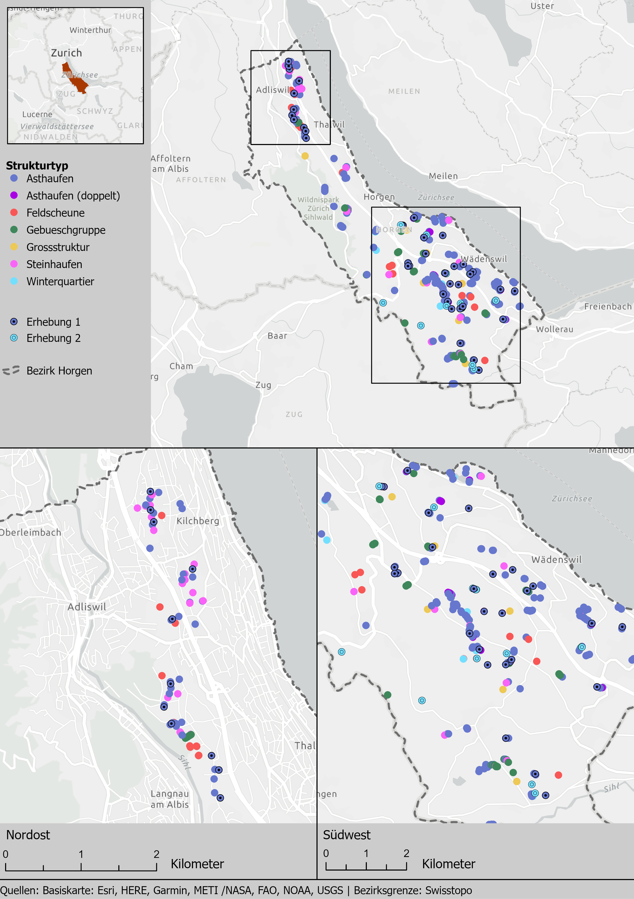
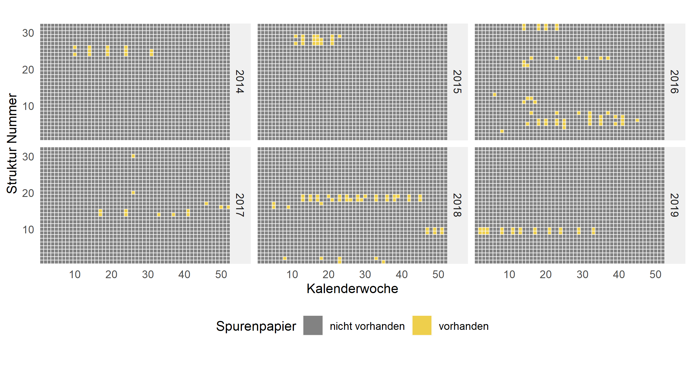
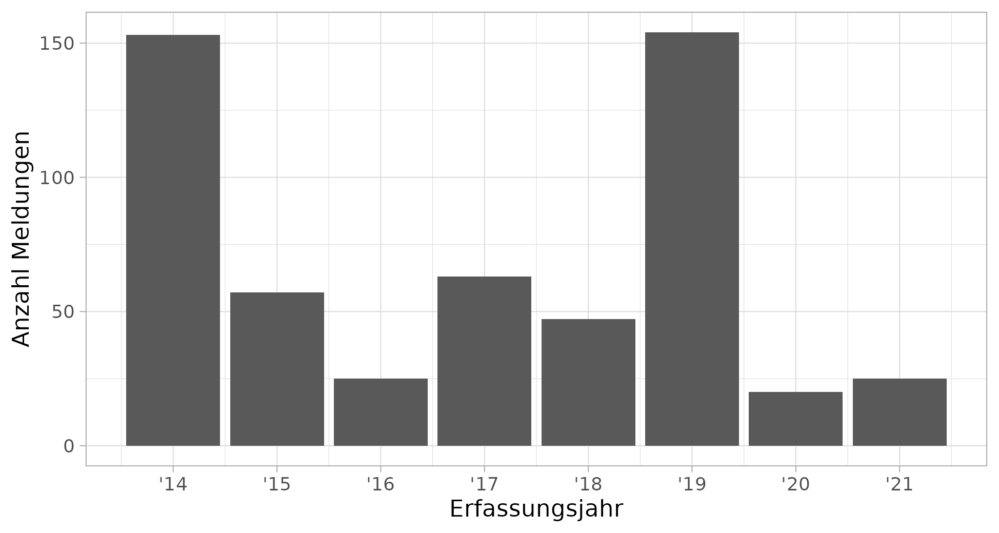

# Methode

## Übersicht

Die Attraktivitätskontrolle besteht aus der Beobachtung zweier verschiedener Massnahmentypen in jeweils zwei Zeitperioden. Ergänzend dazu liegen zwei Datensätze vor, die während der Projektdauer unter Einbezug von interessierten Laien erzeugt wurden (sogenannte Bürgerwissenschaften). Diese Erhebungen und Datensätze werden nachstehend beschrieben und sind in Tabelle \@ref(tab:erhebungswochen) zusammengefasst.

Bei **Erhebung 1** handelt es sich um eine systematische Kontrolle ausgewählter Asthaufen während zweier Jahre (2019 / 2020) über einen definierten Zeitraum. Diese Erhebungen wurden nach einheitlicher Vorgehensweise durchgeführt. Im gleichen Zeitraum wurden in **Erhebung 2** sogenannte Winterquartiere (siehe [wieselundco.ch/bonus](http://www.wieselundco.ch/bonus)), ebenfalls systematisch beobachtet. **Erhebung 3** ist eine Aufnahme und Beurteilung qualitativer Merkmale derjenigen Asthaufen, in desen Spurentunneln  am meisten und am wenigsten Zielarten nachgewiesen wurden. 

Bei **Datensatz A** handelt es sich um die Resultate von spontan durchgeführten Kontrollen einzelner Asthaufen und Grossstrukturen mit Fotofallen und / oder Spurentunneln. Diese Kontrollen dienten unter anderem auch dazu, Freiwilligen, Naturschutzvereinsmitgliedern sowie Schüler\*innen einen tieferen Einblick in das Projekt und dessen Ziele zu geben. Bei **Datensatz B** handelt es sich umSichtungsmeldungen aus der Bevölkerung, die seit Projektbeginn über ein Onlinetool erfasst werden ([wieselundco.ch/sichtungskarte](http://www.wieselundco.ch/beobachtung)).


```{r erhebungswochen}
read_csv("input/erhebungswochen.csv") %>%
  kbl(booktabs = TRUE, caption = "Zusammenfassung der Ansätze, die für die Datenbeschaffung verfolgt wurden.") %>%
  kable_styling(latex_options = "striped") %>%
  column_spec(3, latex_column_spec = "p{20mm}") %>%
  column_spec(5, latex_column_spec = "p{22mm}") %>%
  column_spec(6, latex_column_spec = "p{40mm}")

```


(ref:layoutstrukturen) Perimeter des Projekts Wiesel und Co am Zimmerberg sowie der umgesetzten Massnahmen während der Projektdauer (Total ca. 450 Strukturen). Die untersuchten Asthaufen und Winterquartiere aus Erhebung 1 und 2 sind farblich markiert.


```{r layoutstrukturen, fig.cap="(ref:layoutstrukturen)", out.width="100%"}

```

## Erhebung 1: Attraktivitätskontrolle von Asthaufen mittels Spurentunneln

In diesem Ansatz sind 39 Asthaufen in zwei Jahren über einen Zeitraum von je 6 Wochen systematisch mit Spurentunneln untersucht worden. Die Untersuchungen fanden im Herbst 2019 sowie im Frühling 2020 statt (nähere Angaben siehe Abbildung \@ref(fig:erhebungswoche)). Details zu dieser Erhebungsmethode können aus King et al. (1977) entnommen werden.

Von den 39 beobachteten Asthaufen liegen 11 im Nordwesten (Gemeinde Kilchberg) und 28 im Südosten (Gemeinde Wädenswil) des Bezirks Horgen (siehe Abbildung \@ref(fig:layoutstrukturen)). Bei der Standortwahl wurde darauf geachtet, dass sie in der jeweiligen Region möglichst gut auf die Gesamtheit aller Standorte verteilt wurden. Ausserdem wurden Standorte bevorzugt, die wenig begangen werden, um das Risiko von Fremdmanipulationen zu reduzieren.

Die Kontrollen fanden wöchentlich und nach einheitlichem Schema statt (nach Anleitung von Müri et al., 2015). Die Spurentunnel wurden nach Möglichkeit mit der Öffnung von der Wetterseite abgewendet, um die Tinte der Witterung weniger auszusetzen. Zudem wurde bei Asthaufen an Wald- oder Heckenrändern die Tunnelöffnung immer zum Offenland ausgerichtet. Die Tintenkissen der Spurentunnel wurden beim Ausbringen der Tunnel getränkt und es wurde während der Dauer des Monitorings nach Bedarf Tinte nachgefüllt. Dabei wurden jeweils auch die Spurenpapiere ausgewechselt und die Struktur-ID, das Einlage- und Entnahmedatum, sowie die Laufrichtung notiert.

Um die Artbestimmung der erfassten Spuren sicherzustellen, erfolgte die Auswertung der Spurenpapiere durch Simon Capt vom CSCF, der viel Erfahrung in der Interpretation von Trittsiegeln besitzt (u.a. nationales Mustelidenmonitoring, Capt et al, 2010). Die Analyse der Resultate beschränkt sich auf die Zielarten Hermelin, Mauswiesel und Iltis. 


(ref:erhebungswoche) Visualisierung der Kontrollphase der beiden Erhebungsperioden. Der rote Punkt markiert das Ausbringen der Spurentunnel, die schwarzen Punkte stellen jeweils die Daten dar, an denen die Spurenpapiere ausgetauscht wurden. Aus logistischen Gründen wurden im Herbst 2019 nur 4 Kontrollgänge durchgeführt, was sich jedoch nicht auf die Resultate auswirken sollte.

```{r erhebungswoche, fig.cap="(ref:erhebungswoche)", out.width="100%"}

if(run_full){
  
  
  ggplot(erhebungswochen, aes(x = bis,y = "Kontrollphase")) +
    geom_segment(lineend = "round",aes(xend = von, yend = "Kontrollphase"), color='#a7a9ac', size = 6)+ 
    geom_point(size = 6) +
    geom_point(data = ~slice_head(group_by(., Phase),n = 1), aes(x = von),colour = "red", size = 6) +
    labs(x = "", y = "") +
    scale_x_date(date_breaks = "1 months", date_labels = "%b %y",minor_breaks = NULL) +
    theme_light() +
    theme(panel.grid.major.y = element_blank(), axis.text.y = element_blank(), axis.ticks.y = element_blank()) +
    facet_grid(~Phase, scales = "free_x",space = "free")
  
  ggsave("images/Erhebungswochen.png",height = 2.6,width = 17, scale = 0.5)

}


knitr::include_graphics("images/Erhebungswochen.png")
```


## Erhebung 2: Attraktivitätskontrolle von Winterquartieren mittels Fotofallen

Die Überwachung der Winterquartiere wurde während sechs Wochen zwischen dem 26.08.2019 und 06.10.2019 sowie zwischen dem 30.3.2020 und 10.04.2020 durchgeführt. Untersucht wurden 11 Winterquartiere (alle in der Region Südost, siehe Abbildung \@ref(fig:layoutstrukturen)).

Zur Untersuchung der Winterquartiere wurden Fotofallen mit Infrarotblitz von Bushnell verwendet. Als Setup wurde pro Auslösung ein Foto, sowie ein Film von 5 bis 10 Sekunden aufgenommen. Die Kameras wurden an einem eigens dafür eingeschlagenen Pfosten montiert, ergänzt mit einem Informationsblatt für Passanten.

Zur Auswertung der Bild- und Videoaufnahmen wurden sämtliche Dateien einzeln durchgeschaut und alle gefundenen Tiergruppen (ausser Mäusen und Katzen) aufaddiert. Die nachfolgende Analyse der Zahlen beschränkt sich jedoch auf die Zielarten. 

## Erhebung 3: Qualitative Beurteilung der Asthaufen zur Erörterung attraktivitätsfördernder Faktoren

Die Erhebung erfolgte am 30. und 31. März. Von den 50 kontrollierten Asthaufen wurden jene 12 ohne Nachweise ("unattraktivsten") und jene 13 mit 2 bis 7 Nachweisen ("attraktivsten") qualitativ beurteilt. Dabei wurden 10 Parameter erhoben und jeweils einer der Klassen 0 bis 4 
zugeteilt. Die Parameter und ihre Skalenrichtung ist in TABELLE (Zellen D1 bis M1 von WK_Qualitativ_Ah_20210408.xlsx) 
[WK_Qualitativ_Ah_20210408.xlsx](https://github.com/wieselundco/erfolgskontrolle/files/6588503/WK_Qualitativ_Ah_20210408.xlsx)
ersichtlich. Fast alle Parameter weisen keine exakt abgrenzbaren Klassifizierungskriterien auf. Die Erhebung kommt bei den Parametern "Störung", "Beuteangebot", "Katzen" und "andere Feinde" einer Schätzung gleich; die Beurteilung erfolgte aufgrund von Indizien wie der Nähe zu Wanderrouten bzw. der Sichtung von Maushaufen bzw. Siedlungsnähe bzw. der Lebensraumqualität für grössere Prädatoren. Dagegen ist das Alter eindeutig bestimmbar und Volumen sowie Astmaterial kann direkt dokumentiert und somit relativ zu den anderen Asthaufen beurteilt werden. (grobes Astmaterial; Klasse 4 vgl. Foto x: 2021-03-31 11.30.21-1_snip.jpg . feines Astmaterial; Klasse 1 vgl. Foto y 2021-03-31 16.23.53_korr.jpg). 
Zur Auswertung wurden die Klassen 0 bis 2 (am Bsp. Astmaterial: "feines Material") und 3 bis 4 (am Bsp. Astmaterial: "grobes Material") zusammengefasst. In der Folge wurde je Klasse die Anzahl der  Asthaufen mit Nachweisen jener Anzahl ohne Nachweise in einem statistischen Verfahren (NAME?) gegenüber gestellt. 


## Datensatz A: Unsystematische Attraktivitätskontrolle von Asthaufen

Im Datensatz werden alle 32 Asthaufen berücksichtigt, die unmittelbar nach der Erstellung im Rahmen von Aktionstagen mit Spurentunnel ausgestattet und über einen variablen Zeitraum kontrolliert wurden (siehe Anhang C). In ca. 50% der Erhebungen wurden ergänzend Fotofallen eingesetzt. Die Erhebung dauerte in der Regel deutlich länger als 6 Wochen (höhere Detektionswahrscheinlichkeit), die Kontrollintervalle waren oft grösser als 2 Wochen (vermehrter Datenausfall). Die Erstellung (und Attraktivitätskontrolle) der Asthaufen verteilt sich über die Jahre 2014 bis 2019, wobei es 2016 zu einer Häufung kam. Es kam zu allen Jahreszeiten zu Kontrollaktivitäten, vermehrt im Frühling. Folgende Faktoren erschweren die Verwendung dieser Daten für einen Zielvergleich:

- die Kontrollen in der Kontrollphase (Dauer und Regelmässigkeit) wurden nicht einheitlich durchgeführt
- leere Spurenpapiere wurden nicht systematisch dokumentiert. Es ist nicht genau nachvollziehbar, wie intensiv eine Struktur beobachtet wurde. Der Nachweiserfolg kann somit kaum in den Kontext des Nachweisefforts gesetzt werden.
- die Auswahl der Standorte erfolgte vor allem aus praktischen Überlegungen (Aktionstage, Interesse der Teilnehmenden)

Da der Datensatz mit beachtlichem Aufwand erhoben wurde, wird er in den vorliegenden Bericht integriert. Abbildung \@ref(fig:wirkungskontrollespontaneffort) zeigt, für welche Kalenderwochen in welchen Jahren für eine Struktur ein Spurenpapier vorhanden ist. Dabei stellt jedes Quadrat eine Kalenderwoche einer Struktur dar und ist gelb eingefärbt, wenn ein Spurenpapier für diesen Zeitraum vorhanden ist.

(ref:wirkungskontrollespontaneffort) Visualisierung der fortlaufend kontrollierten Asthaufen (nach Ansatz 1). Jedes Quadrat stellt eine Kalenderwoche aus einem Jahr einer Struktur dar. Das Quadrat ist gelb eingefärbt, wenn in der entsprechenden Kalenderwoche ein Spurenpapier vorhanden ist und grau, wenn keines vorhanden ist.

```{r wirkungskontrollespontaneffort, fig.cap="(ref:wirkungskontrollespontaneffort)", out.width="100%"}

if(run_full){
  nachweise_spontan %>%
    filter(Jahr < 2020) %>%
    mutate(Struktur = as.integer(factor(Struktur))) %>%
    transmute(Struktur, Jahr = as.integer(Jahr),KW, kontrolle = TRUE) %>%
    complete(nesting(Struktur),Jahr = 2014:2019,KW = 1:52,fill = list(kontrolle = FALSE)) %>%
    ggplot(aes(KW,Struktur,fill = kontrolle)) +
    geom_tile(colour = "white",lwd = 0.3) +
    facet_wrap(~Jahr, strip.position = "right",ncol = 3) +
    scale_fill_manual(breaks = c(FALSE,TRUE),labels = c("nicht vorhanden","vorhanden"),values = c("#828282","#EECF4C")) +
    coord_equal(expand = FALSE) +
    labs(x = "Kalenderwoche",y = "Struktur Nummer", fill = "Spurenpapier") +
    theme(legend.position = "bottom",panel.grid.minor = element_blank(),panel.background = element_blank(),axis.ticks = element_blank(),strip.background = element_rect(fill = "#F0F0F0"))
  
  ggsave("images/wirkungskontrolle_spontan_effort.png",height = 9,width = 17,units = "cm",scale = 1.2)
} else{
  
}


```


## Datensatz B: Beobachtungsmeldungen

Seit Anbeginn des Projekts wurde die örtliche Bevölkerung dazu aufgerufen, Beobachtungen von Kleinraubtieren über das eigens dafür eingerichtete Webtool zu melden. Meldungen wurden auch via einen Flyer sowie per Mail oder auch mündlich aufgenommen. Beobachtungsmeldungen wurden durch den Projektleiter (Stefan Keller) verifiziert und in «unsicher», «plausibel» sowie «sicher» eingeteilt.

Auf diese Weise sind über 500 Meldungen zusammengetragen worden. Alle Meldungen, die über andere Kanäle als das Webtool erfasst wurden, sind vom Projektleiter gesammelt und periodisch in die Datenbank integriert worden. Diese erhielten als «Erfassungsdatum» jeweils das Datum dieser Überführung in die Datenbank, so sind im zeitlichen Verlauf der Meldungen deutliche Spitzen erkennbar (siehe Abbildung \@ref(fig:beobachtungsmeldungenhistogramm)).

(ref:beobachtungsmeldungenhistogramm) Anzahl gemeldete Beobachtungen pro Jahr, in dem die Meldung in die Datenbank eingetragen wurden. Die hohen Spitzen sind dadurch begründet, dass mehrere, schriftlich vorliegende Meldungen vom Projektleiter in der Datenbank erfasst wurden.

```{r beobachtungsmeldungenhistogramm, fig.cap="(ref:beobachtungsmeldungenhistogramm)", out.width="100%"}

if(run_full){
  beobachtungsmeldungen %>%
    st_drop_geometry() %>%
    mutate(year = year(erfassungsdatum))%>%
    group_by(year) %>%
    count() %>%
    ggplot(aes(year, n)) +geom_col() +
    scale_x_continuous(breaks = function(x){seq(floor(x[1]),ceiling(x[2]),1)},labels = function(x){paste0("'",x-2000)}) +
    labs(y = "Anzahl Meldungen", x = "Erfassungsjahr") +
    theme_light() 
  
  ggsave("images/beobachtungsmeldungen_histogramm.png",height = 8, width = 15, units = "cm",scale = 1.1)
  
} else{
  
}


```


