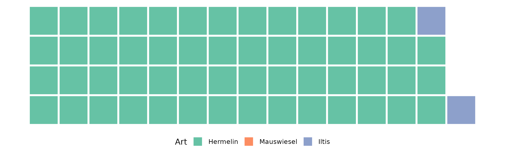
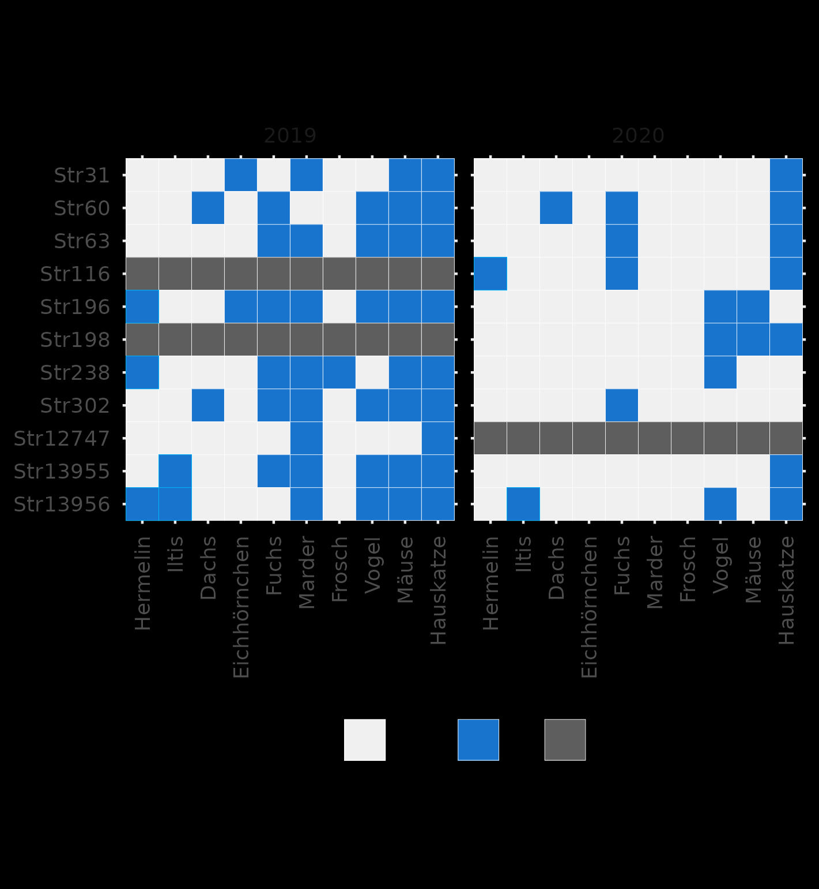

# Resultate

## Erhebung 1: Attraktivitätskontrolle von Asthaufen mittels Spurentunneln

Anhand der Spurenpapiere konnten im Herbst 2019 32 Einzelnachweise von Hermelinen, sowie 2 Einzelnachweise von Iltissen aufgezeichnet werden. Die dritte Zielart, das Mauswiesel, konnte an keinem Standort nachgewiesen werden. Im Frühling 2020 konnten 23 Einzelnachweise von Hermelinen gemacht werden, jedoch keine vom Iltis oder vom Mauswiesel. Über beide Studien konnten somit 55 Einzelnachweise vom Hermelin und zwei Einzelnachweise vom Iltis gemacht werden (siehe Abbildung \@ref(fig:wirkungskontrollesystematischeinzelnachweisewaffle)).

(ref:wirkungskontrollesystematischeinzelnachweisewaffle) Anzahl Einzelnachweise pro Zielart über beide Untersuchungsperioden (Herbst 2019 und Frühling 2020): Insgesamt wurde das Hermelin 55-mal, der Iltis 2-mal und das Mauswiesel gar nicht nachgewiesen.

```{r wirkungskontrollesystematischeinzelnachweisewaffle, fig.cap="(ref:wirkungskontrollesystematischeinzelnachweisewaffle)", out.width="100%"}

if(run_full){
  spurenpapiere_systematisch %>%
    filter(tierart %in% c("Hermelin","Iltis","Mauswiesel"),
           Detektion) %>%
    waffle_iron(aes_d(group = tierart),rows = 4) %>% 
    mutate(group = fct_expand(group,"Mauswiesel")) %>% 
    ggplot(aes(x,y, fill = group)) +
    geom_tile(colour = "white",lwd = 1.2) +
    scale_fill_manual(name = "Art",drop = FALSE,values = tierart_farben) +
    coord_equal() +
    theme_void() +
    theme(legend.position = "bottom")
  
  ggsave("images/wirkungskontrolle_systematisch_einzelnachweise_waffle.png", height = 5,width = 17, units = "cm",scale = 1.4)
  
} else{
  
}


```


Da es sich bei gewissen Nachweisen vermutlich um Mehrfachbeobachtung des gleichen Individuums handelt, ist der Anteil an Strukturen mit mindestens einem Nachweis aussagekräftiger. Im Herbst 2019 konnte in 19 von 39 Asthaufen (49 %) mindestens eine Zielart nachgewiesen werden. In 18 von 39 Asthaufen (46 %) wurde das Hermelin detektiert, in 2 von 39 Asthaufen (5 %) der Iltis. Im Frühling 2020 wurde in 14 von 39 Asthaufen (36 %) eine Zielart detektiert, wobei es sich immer um Hermeline handelte (siehe Abbildung \@ref(fig:strukturenmitzielart)). Über beide Untersuchungsperioden hinweg konnte in 27 von 39 Asthaufen (69 %) mindestens eine Zielart detektiert werden.


(ref:strukturenmitzielart) Anzahl sowie Anteil der untersuchten Strukturen, in denen mindestens eine Zielart nachgewiesen werden konnte.

```{r strukturenmitzielart, fig.cap="(ref:strukturenmitzielart)", out.width="100%"}

if(run_full){
  p1 <- spurenpapiere_systematisch %>%
    filter(zielart) %>%
    mutate(phase = fct_rev(phase)) %>%
    group_by(struktur_id,phase) %>%
    summarise(zielart = any(Detektion)) %>%
    group_by(phase,zielart) %>%
    count() %>%
    group_by(phase) %>%
    mutate(
      zielart = ifelse(zielart,"ja","nein")
    ) %>%
    arrange(phase,zielart) %>%
    mutate(
      zielart = fct_rev(zielart),
      pos = (lag(n,default = 0)+n)/2,
      perc = n/sum(n)
    ) %>%
    ggplot(aes(n,phase, fill = zielart)) + 
    geom_col() +
    geom_text(aes(x = pos, label = paste0(n, " (",round(perc*100,0),"%)")),position = "stack") +
    scale_fill_discrete(type = janein_cols) +
    labs(fill = "Zielart detektiert", x = "", y = "") +
    theme_light() +
    theme(legend.position = "none",
          axis.text.x = element_blank(),
          axis.ticks.x = element_blank())
  
  p2 <- spurenpapiere_systematisch %>%
    filter(zielart) %>%
    mutate(phase = fct_rev(phase)) %>%
    group_by(struktur_id) %>%
    summarise(zielart = any(Detektion)) %>%
    group_by(zielart) %>%
    count() %>%
    ungroup() %>%
    mutate(
      zielart = ifelse(zielart,"ja","nein")
    ) %>%
    arrange(zielart) %>%
    mutate(
      zielart = fct_rev(zielart),
      pos = (lag(n,default = 0)+n)/2,
      perc = n/sum(n)
    )%>%
    ggplot(aes(n,"Beide Jahre", fill = zielart)) + 
    geom_col() +
    geom_text(aes(x = pos, label = paste0(n, " (",round(perc*100,0),"%)")),position = "stack") +
    scale_fill_discrete(type = janein_cols) +
    labs(fill = "Zielart detektiert", x = "Anzahl Strukturen", y = "") +
    guides(fill = guide_legend(reverse = TRUE)) +
    theme_light() +
    theme(legend.position = "bottom")
  
  p3 <- cowplot::plot_grid(p1, p2, ncol = 1,rel_heights = c(4,4.6),align = "v")
  
  p3
  cowplot::save_plot("images/strukturen_mit_zielart.png",p3,ncol = 1,base_height = 3,base_width = 8)
} else{
  knitr::include_graphics("images/strukturen_mit_zielart.png")
  
}

```


(ref:hermelinstr196) Ein Hermelin, welches einen im Projekt erstellten Asthaufen als Deckungsstruktur nutzt.

```{r hermelinstr196, fig.cap="(ref:hermelinstr196)", out.width="100%"}
knitr::include_graphics("images/str196/capture.jpg")
```

```{r,results = "asis"}
youtube("4gVpcvPIrNA", "Die ganze Sequenz des Hermelins in Str.196")
```


## Erhebung 2: Attraktivitätskontrolle von Winterquartieren mittels Fotofallen

Aus der Fotofallen-Überwachung der Winterquartiere resultierten 2019 an zwei Standorten Aufnahmen von Hermelinen, sowie an zwei Standorten von Iltissen (siehe Abbildung \@ref(fig:winterquartiereresultate)). Im Folgejahr (2020) gelangen Nachweise vom Hermelin an einem neuen Standort und vom Iltis an einem Standort mit Nachweis im Frühling 2019. Zusammenfassend über beide Jahre kann gesagt werden, dass in 5 von 11 untersuchten Winterquartieren (45%) mindestens eine Zielart festgestellt werden konnte (4 Hermelin- und 3 Iltis-Nachweise). Alle 3 Winterquartiere in Feldscheunen (sanierte Streuhütten) wiesen Nachweise auf (2 des Hermelins, 3 des Iltis).
Jedes Winterquartier wurde von zahlreichen Tierarten genutzt: Dachse, Eichhörnchen, Füchse, Marder, Frösche, Vögel und Mäusen wurden von den Kameras abgelichtet.

Die Daten der Standorte Str116 und Str198 konnten 2019 und die von Str12747 im Jahr 2020 nicht ausgewertet werden. Die Kameras an den genannten Standorten wiesen eine Fehlfunktion auf und erfassten so viele Bilder, dass eine Auswertung der Daten unverhältnismässig viel Zeit in Anspruch genommen hätte.

(ref:winterquartiereresultate) Zusammenfassung der Resultate aus der Überwachung der Winterquartiere mit sämtlichen Tierarten

```{r winterquartiereresultate, message=FALSE, fig.cap="(ref:winterquartiereresultate)", out.width="100%"}
if(run_full){
  translate <- tribble(
    ~value, ~newvalue, ~beschreibung,
    "x", TRUE, "ja",
    NA, FALSE, "nein",
    "-", NA, "keine Daten"
  ) %>%
    mutate(
      beschreibung = fct_inorder(beschreibung)
    )
  
  
  winterquartiere_resultate <- readr::read_csv("input/winterquartiere_resultate.csv") %>%
    pivot_longer(Hermelin:Hauskatze)  %>%
    mutate(
      name = fct_inorder(name),
      Struktur_ID = fct_relevel(Struktur_ID,function(x){as.character(paste0("Str",sort(parse_number(x),TRUE)))}),
    ) %>%
    left_join(translate, by = "value")
  
  
  ggplot(winterquartiere_resultate, aes(name,Struktur_ID, fill = beschreibung)) +
    geom_tile(colour = "white") +
    geom_tile(data = ~filter(., name %in% c("Hermelin","Iltis"), newvalue),colour = "deepskyblue",show.legend = FALSE) +
    facet_wrap(~Jahr) +
    scale_fill_manual(values = c("dodgerblue3","gray94", "gray37")) +
    labs(fill = "Detektion") +
    coord_fixed() +
    theme_minimal() +
    theme(
      legend.position = "bottom",
      axis.title = element_blank(),
      axis.text.x = element_text(angle = 90,hjust = 1, vjust = 0.5)
    )
  
  
  ggsave("images/winterquartiere_resultate.jpg")
} else{
  
}


```


```{r, fig.cap="Bilderserien zeugen davon, dass die Winterquartiere von den Zielarten genutzt werden. Das Hermelin im Bild nutzt das kleine Schlupfloch und erkundet den geschützten Hohlraum, der durch die Anordnung der Strohballen besteht (Str. 238)", out.width="49%",fig.show = "hold"}
knitr::include_graphics(list.files("images/str238/",full.names = TRUE))
```


```{r,results = "asis"}
youtube("YomCsy1olBs")

youtube("ttv-LHkzc18", "Die ganze Sequenz des Hermelins in Str.238")

```


```{r, fig.cap="Der Iltis, der meist dämmerungs- und nachtaktiv ist, wurde an einem Winterquartier auch tagsüber (12:50 Uhr, siehe Zeitstempel im Bild) detektiert (Str.13956)",fig.show = "hold", out.width="100%"}

knitr::include_graphics(c("images/str13956/09280317.JPG","images/str13956/capture.jpg"))

```


```{r,results = "asis"}
youtube("O5la_63_u_w")

youtube("VCjIpFX3TO0")


youtube("VCjIpFX3TO0")

youtube("Hi7ddE5r7B4")


youtube("ISg0ZA5Fvgo", "Die ganze Sequenz des Hermelins in Str.13956")

```

## Erhebung 3: Qualitative Beurteilung der Asthaufen zur Erörterung attraktivitätsfördernder Faktoren


```{r}
asthaufen_qualitaet_list %>%
  imap(function(x, code){
    x %>%
      filter(!is.na(beurteilung)) %>%
      mutate(beurteilung = fct_relabel(beurteilung, ~str_replace(., "sehr ","s."))) %>%
      group_by(beurteilung,.drop = FALSE) %>%
      summarise(n = sum(as.integer(total_nach_weise_wk_2019_2020))) %>%
      ggplot(aes(beurteilung, n)) + 
      geom_col() +
      scale_x_discrete(drop = FALSE) %>%
      labs(title = str_to_title(str_replace_all(code, "_", " ")), x = "", y = "") +
      lims(y = c(0,26)) +
      theme_light()
  }) %>%
  cowplot::plot_grid(plotlist = .)


res <- imap(asthaufen_qualitaet_list, function(x, type){
  x <- x %>%    
    dplyr::transmute(beurteilung = (beurteilung))
  
  names(x) <- type
  x
}) %>%
  do.call("cbind", .) %>%
  cbind(
  asthaufen_qualitaet_list[[1]][, "total_nach_weise_wk_2019_2020"],
  .
)

res_long <- res %>%
  pivot_longer(-total_nach_weise_wk_2019_2020)

res %>%
  mutate(besucht = (total_nach_weise_wk_2019_2020>0)) %>%
  dplyr::select(-total_nach_weise_wk_2019_2020) %>%
  # mutate(across(is.factor, ~as.integer(.))) %>%
  glm(besucht~astmaterial,family = "binomial", data = .) %>%
  summary()


res$astmaterial
res %>%
  mutate(besucht = total_nach_weise_wk_2019_2020>0) %>%
  count(besucht, astmaterial) %>%
  ggplot(aes(astmaterial, n, fill = besucht)) + geom_col(position = "dodge") +
  facet_wrap(~besucht)
  
  


```

## Datensatz A: Unsystematische Attraktivitätskontrolle von Asthaufen

In den insgesamt 32 beobachteten Asthaufen konnte das Hermelin 51 und der Iltis 23-mal nachgewiesen werden (siehe Abbildung \@ref(fig:wirkungskontrollespontaneinzelnachweisewaffle)): Wie auch schon in der systematischen Wirkungskontrolle, konnte auch in dieser Erhebung das Mauswiesel nicht nachgewiesen werden. Dafür wurde der Iltis einiges häufiger detektiert, in der systematischen Wirkungskontrolle konnten nur zwei Iltisnachweise erbracht werden.

(ref:wirkungskontrollespontaneinzelnachweisewaffle) Zusammenstellung aller Einzelnachweise der Zielarten Hermelin (51 Nachweise), Iltis (23 Nachweise) sowie Mauswiesel (keine Nachweise).

```{r wirkungskontrollespontaneinzelnachweisewaffle, fig.cap = "(ref:wirkungskontrollespontaneinzelnachweisewaffle)", out.width="100%"}

if(run_full){
  
  nachweise_spontan %>%
    pivot_longer(Mäuse:Ratte,"Art", values_to = "Detektion") %>%
    filter(Art %in% c("Hermelin","Iltis","Mauswiesel"),
           Detektion == 1) %>%
    waffle_iron(aes_d(group = Art),rows = 4) %>% 
    mutate(group = fct_expand(group,"Mauswiesel")) %>% 
    ggplot(aes(x,y, fill = group)) +
    geom_tile(colour = "white",lwd = 1.2) +
    scale_fill_manual(name = "Art",drop = FALSE,values = tierart_farben) +
    coord_equal() +
    theme_void() +
    theme(legend.position = "bottom")
  
  
  ggsave("images/wirkungskontrolle_spontan_einzelnachweise_waffle.png", height = 5,width = 17, units = "cm",scale = 1.4)

}

knitr::include_graphics("images/wirkungskontrolle_spontan_einzelnachweise_waffle.png")
```


Wie bereits erwähnt, kann es sich bei den Einzelnachweisen oft um Mehrfachnachweise des gleichen Individuums handeln. Es ist deshalb sinnvoll, auch den Anteil der Asthaufen mit Nachweisen der Zielart denjenigen ohne Detektion gegenüber zu stellen: In 25 der 32 Asthaufen (78%) konnte mindestens eine der Zielarten festgestellt werden. In 18 Fällen (60%) konnte das Hermelin nachgewiesen werden, in 8 Fällen (36%) der Iltis. In keinem Fall konnte das Mauswiesel in einem Asthaufen nachgewiesen werden.

(ref:wirkungskontrollespontanstrukturenmitzielart) Anteil der Strukturen, bei dem mindestens eine Zielart nachgewiesen werden konnte.

```{r wirkungskontrollespontanstrukturenmitzielart, fig.cap = "(ref:wirkungskontrollespontanstrukturenmitzielart)", out.width="100%"}
if(run_full){
  nachweise_spontan %>%
    mutate(Zielart = Hermelin == 1 | Iltis == 1)  %>%
    group_by(Struktur) %>%
    summarise(zielart = ifelse(any(Zielart,na.rm = TRUE),"ja","nein")) %>%
    group_by(zielart) %>%
    count()  %>%
    ungroup() %>%
    mutate(
      zielart = fct_rev(zielart),
      pos = (lag(n,default = 0)+n)/2,
      perc = n/sum(n)
    ) %>%
    ggplot(aes(n, "", fill = zielart)) + 
    geom_col() +
    geom_text(aes(x = pos, label = paste0(n, " (",round(perc*100,0),"%)")),position = "stack") +
    scale_fill_discrete(type = janein_cols) +
    labs(fill = "Zielart detektiert", x = "", y = "") +
    guides(fill = guide_legend(reverse = TRUE)) +
    theme_light() +
    theme(legend.position = "bottom",axis.ticks.y = element_blank())
  
  ggsave("images/wirkungskontrolle_spontan_strukturen_mit_zielart.png",height = 4,width = 16, units = "cm")

  
}else{
  knitr::include_graphics("images/wirkungskontrolle_spontan_strukturen_mit_zielart.png")
  
}
```

## Datensatz B: Beobachtungsmeldungen

Von den 555 Meldungen, die im Projekt gesammelt wurden, handelt es sich bei 546 um Meldungen der Zielarten Hermelin, Iltis und Mauswiesel. Davon wurden 506 Meldungen vom Projektleiter als "plausibel" bzw. "sicher" eingestuft und davon wiederum liegen 428 Meldungen innerhalb des Projektperimeters, dem Bezirk Horgen (siehe Abbildung \@ref(fig:beobachtungsmeldungenfilter)).

Ganz grundsätzlich muss betont werden, dass die Interpretation dieser Meldungen mit einer gewissen Vorsicht gemacht werden muss. Es handelt sich um ein Produkt aus einem "Citizen Science" Ansatz, und wie immer liefern solche Datenerzeugnissen ein verzerrtes Bild der Realität. Die Verzerrung entsteht, weil die Meldungen nicht systematisch erfasst und unterschiedliche Räume ungleich intensiv beobachtet werden. Ein Hermelin in einem stark frequentierten und offenen Gebiet hat eine höhere Wahrscheinlichkeit, beobachtet zu werden als ein Tier in einer schlecht frequentierten, strukturreichen Landschaft. Zudem ist davon auszugehen, dass es sich bei sehr dicht beieinanderliegenden Meldungen um Mehrfachmeldungen des gleichen Tiers (womöglich durch den gleichen Beobachter) handelt.

Die grösste Unsicherheit in Bezug auf ihre Plausibilität besteht bei den Mauswiesel-Sichtungsmeldungen. Die Tierart ist aufgrund der geringen Grösse sehr schwer zu beobachten und zudem für Laien kaum vom Hermelin zu unterscheiden. Während lediglich 1.1 % der Hermelin- und 3.4 % der Iltismeldungen als "unsicher" eingestuft werden, fallen 53.1% aller Mauswiesel-Sichtungsmeldungen in diese Kategorie. So liegen lediglich 23 verwertbare Mauswiesel-Meldungen vor.

(ref:beobachtungsmeldungenfilter) Von den 555 Meldungen, die seit Projektbeginn eingetroffen sind, handelt es sich bei 546 Meldungen um die Zielarten, davon können 506 Meldungen als "plausibel" bzw. "sicher" eingestuft werden. Von diesen Meldungen liegen 428 innerhalb des Bezirks Horgen.

```{r beobachtungsmeldungenfilter, fig.cap = "(ref:beobachtungsmeldungenfilter)", out.width="100%"}

```

Das Hermelin konnte weitestgehend im ganzen Bezirk beobachtet werden, so auch in stark fragmentierten und dicht besiedelten Kulturflächen der Gemeinde Kilchberg und der Halbinsel Au (siehe Abbildung \@ref(fig:layoutbeobachtungsmeldungen)). Deutliche Häufungen von Meldungen sind aber in den weniger verbauten Landschaften wie Horgenberg, Hirzel, Schönenberg zu verzeichnen. Weitestgehend ohne Meldungen sind die Siedlungsgebiete selbst sowie der Sihlwald und das Gemeindegebiet Hütten. Während das Fehlen in Siedlungsgebieten und grösseren Waldflächen ökologisch bedingt ist, ist das Ausbleiben von Meldungen in der Gemeinde Hütten mit grösster Wahrscheinlichkeit ein Artefakt davon, dass in Hütten weniger intensiv beobachtet und gemeldet wird.

Deutlich weniger Sichtungsmeldungen sind zum Iltis eingegangen. Dies wiederspiegelt einerseits die tiefere Anzahl Individuen im Vergleich zur Hermelinpopulation, ist aber auch mit Sicherheit der Lebensweise dieser Tierart geschuldet: Als dämmerungs- und nachtaktives Tier, welches sich auch gerne im Waldrandbereich aufhaltet, ist der Iltis seltener zu beobachten als das Hermelin.

Scheinbar willkürlich verteilt sind die Meldungen von Mauswieselsichtungen. Diese sind über den ganzen Bezirk verteilt und ebenfalls nicht auf ein bestimmtes Gebiet konzentriert. Auch zahlenmässig wurde das Mauswiesel sehr viel seltener gesehen als das Hermelin. Dies hängt einerseits sicher mit der erwähnten Schwierigkeit zusammen, Mauswiesel zu beobachten und diese zuverlässig von Hermelinen zu unterscheiden. Es kann aber zusätzlich davon ausgegangen werden, dass die Mauswieselpopulation im Bezirk eher klein und fragil ist.

(ref:layoutbeobachtungsmeldungen) Beobachtungsmeldungen der Zielarten Hermelin, Iltis und Mauswiesel im Bezirk Horgen.

```{r layoutbeobachtungsmeldungen, fig.cap="(ref:layoutbeobachtungsmeldungen)", out.width="100%"}
knitr::include_graphics("images/Layout_Beobachtungsmeldungen.png")
```
