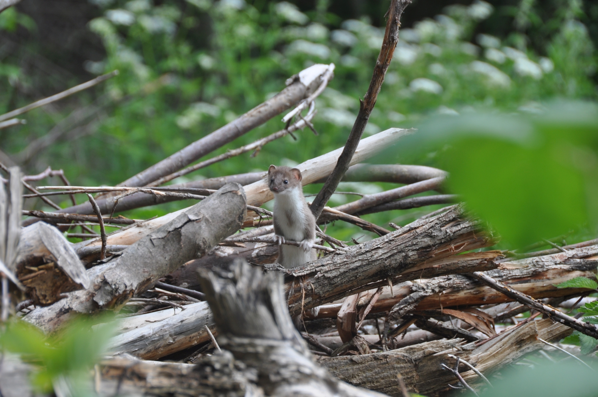

# Diskussion und Fazit

## Vergleich mit den Zielsetzungen von WIN Wieselnetz 

Müri und Weinberger (2015) legen für Projekte im Rahmen von "Wiesellandschaft Schweiz" der Stiftung WIN Wieselnetz Ziele fest, um Erfolgskontrollen quantitativ messen zu können. Dabei wird davon ausgegangen, dass Spurentunnel jeweils beködert werden. Sollte diese Beköderung nicht stattfinden, müssten die Ziele gemäss dem Bericht "nach unten angepasst werden" (Müri und Weinberger, 2014).

In der vorliegenden Untersuchung wurde auf eine Beköderung verzichtet. In diesem Sinne wurden die Ziele für die vorliegende Wirkungskontrolle folgendermassen adaptiert: Anstatt dass die Ziele für jedes Jahr getrennt beurteilt werden, werden die Daten aus beiden Jahren zusammen geführt und über beide Jahre beurteilt (siehe Tabelle \@ref(tab:winziele)). Dieser Ansatz trägt auch den starken Schwankungen in den Wieselpopulationen Rechnung.


```{r winziele, fig.cap="Zieldefinition in Anlehnung an Müri und Weinberger (2014) sowie ihre Beurteilung und Bemerkungen."}

win_ziele <- WIN_ziele %>%
  mutate(
    Zieldefinition = str_replace_all(Zieldefinition, "Patches1", "Patches"),
    Beurteilung = case_when(
      Beurteilung == -1~"rot",
      Beurteilung == 0~"gelb",
      Beurteilung == 1~"gruen"
      )
    )


ampel_ratio = 311/876


ampel_width = 200
win_ziele %>%
  mutate(Beurteilung = "") %>%
  kbl(booktabs = TRUE, caption = "Zieldefinition in Anlehnung an Müri und Weinberger (2014) sowie ihre Beurteilung und Bemerkungen.") %>%
  kable_styling(latex_options = "striped") %>%
  column_spec(2, latex_column_spec = "p{65mm}") %>%
  column_spec(4, latex_column_spec = "p{60mm}") %>%
  column_spec(3, image = spec_image(paste0("images/ampel_", win_ziele$Beurteilung, ".png"), ampel_width,ampel_width*ampel_ratio),latex_valign = "m")

```


Der Zielvergleich fällt folgendermassen aus: Ein Ziel wurden erreicht (Ziel 3), drei Ziele wurden teils erreicht (Ziel 1, 2 und 5) und ein weiteres Ziel konnte nicht erreicht werden (Ziel 4). Grund für die Nicht- bzw. Teilerreichung der Ziele 1 und 4 ist das Fehlen von Mauswieselnachweisen in Erhebung 1 (Systematische Beobachtung der Asthaufen). Dabei ist jedoch zu betonen, dass der Nachweis bei kleinen, fragilen Populationen ungleich schwieriger zu erbringen ist als in Gebieten mit höherem Mauswiesel Vorkommen. Das Projekt hat, insbesondere in der kurzen Laufzeit, nur einen kleinen Einfluss auf die Mauswiesel-Populationsstärke. In diesem Sinne ist das Teilerreichen der Ziele 1 und 5 nicht durch Fehler im Projekt zu erklären, sondern vielmehr eine ökologische Gegebenheit. 

## Nachweisquote im Vergleich mit anderen Studien

Der Austausch mit Projektleitern und Ökologen anderer Wieselprojekte in der Schweiz zeigt, dass die gesetzten Nachweisziele von WIN Wieselnetz (Tabelle \@ref(tab:winziele)) sehr hoch gesteckt sind. Aus diesem Grund wurden die Resultate anderer Studien zusammengetragen und in Abbildung \@ref(fig:kontext) visualisiert. Dargestellt sind die "Nachweiserfolge" von verschiedenen Studien, definiert als der Anteil der Spurentunnel, die mindestens einen Hermelinnachweis erbracht haben. Die Abbildung macht deutlich, dass die vorliegende Studie einen sehr hohen Nachweiserfolg zu verzeichnen hat.
Der Anteil der Spurentunnel mit Hermelinnachweisen im Vergleich zur totalen Anzahl eingesetzter Spurentunnel ist ausserordentlich hoch und liegt bei 49 % (2019) bzw. 36 % (2020). 
<!-- [FOLGENDES WEGLASSEN DA NICHT VERGLEICHBAR MIT DEN EK'S IN ABB 5.1?? -->
<!-- und bei knapp 70 % über beide Jahre kummuliert. ]  -->
Das Ergebnis der unsystematischen Wirkungskontrolle (Datensatz B, siehe \@ref(methode-datensatz-b)) hebt sich noch stärker von anderen Untersuchungen ab, wobei die methodischen Eigenschaften (insbesondere die langen Kontrollperioden), die Vergleichbarkeit einschränken.

Eine Erklärungsmöglichkeit für die hohen Nachweisquoten ist die grosse Dichte an Schermäusen, welche eine vorzügliche Nahrungsgrundlage für Hermeline (und Mauswiesel) bildet. Die hinzukommenden Kleinstrukturen in der streckenweise strukturarmen Zimmerberglandschaft üben eine starke Anziehungskraft aus. Wären viele andere Kleinstrukturen vorhanden, könnte der Nachweiserfolg kleiner sein, auch wenn zugleich die Hermelinpopulation grösser wäre.

(ref:kontext) Der Nachweiserfolg aus Spurentunneluntersuchungen anderer Studien (für Quellenangaben siehe Anhang \@ref(anhang-zusammenstellung))

```{r kontext, fig.cap="(ref:kontext)", out.width="100%"}
if(run_full){
  nachweiserfolg_ref <- nachweiserfolge_zusammenstellung %>%
    mutate(
      Studie = paste(Bezeichnung,Jahr),
      nachweiserfolg = tunnel_mit_nachweisen / tunnel_total,
      erfolgskontrolle_name = ifelse(erfolgskontrolle,"Erfolgskontrollen","andere Untersuchungen"),
    )
  
  vorliegende_studie <- c("Horgen 2019", "Horgen 2020", "Horgen 2014 - 2019")
  
  
  nachweiserfolg_smry <- nachweiserfolg_ref %>%
    group_by(erfolgskontrolle_name) %>%
    summarise(
      tunnel = median(tunnel_total),
      nachweiserfolg_median = median(nachweiserfolg),
      nachweiserfolg_q75 = quantile(nachweiserfolg, 0.75),
      nachweiserfolg_q25 = quantile(nachweiserfolg, 0.25),
    ) %>%
    mutate(
      Studie = "Verteilung"
    )
  
  nachweiserfolg_ref2 <- bind_rows(nachweiserfolg_ref, nachweiserfolg_smry) %>%
    mutate(
      Studie = fct_reorder(Studie,nachweiserfolg),
      erfolgskontrolle_name = fct_rev(erfolgskontrolle_name),
      Studie = fct_relevel(Studie,"Verteilung",after = 0)
    )
  
  
  
  nachweiserfolg_ref2%>%
    ggplot(aes(nachweiserfolg,Studie, size = tunnel_total)) +
    geom_point() +
    geom_point(data = ~filter(.,Studie %in% vorliegende_studie),colour = "red") +
    geom_point(data = ~filter(.,!Studie %in% vorliegende_studie)) +
    geom_pointrange(aes(x = nachweiserfolg_median, xmin = nachweiserfolg_q25, xmax = nachweiserfolg_q75, y = Studie),inherit.aes = FALSE) +
    labs(size = "Anzahl Spurentunnel", y = "", x = "Nachweiserfolg") +
    scale_x_continuous(labels = scales::percent_format(),limits = c(0,1)) +
    # scale_size(limits = c(20,100)) +
    # lims(x = c(0,100)) +
    theme_light() +
    theme(legend.position = "bottom") +
    facet_grid(erfolgskontrolle_name~., scales = "free_y",space = "free")
  
  
  ggsave("images/kontext.png",height = 15, width = 20, units = "cm")
} else{
  knitr::include_graphics("images/kontext.png")
}


```

## Interpretation der Nachweiszahlen

### Hermlin vs. Mauswiesel

Die Nachweiszahlen zeigen, dass das Hermelin am Zimmerberg die deutlich häufigste der drei Zielarten ist. Datensatz B zeigt bei den Beobachtungsmeldungen ca. ein Verhältnis von 1 Mauswiesel und 1 Iltis auf 20 Hermeline. 
Gegenüber 59 Hermelinnachweisen während der Wirkungskontrolle wurde der Iltis 5 Mal nachgewiesen und das Mauswiesel wurde nur 1 Mal mit Spurentunnel ausserhalb der regulären Wirkungskontrolle festgestellt. 

```{r, echo = FALSE}
tribble(
  ~Typ, ~Hermelin, ~Iltis, ~Mauswiesel,
  "Asthaufen", 55L, 2L, 0L,
  "Winterquartiere", 4L, 3L, 0L
) %>%
  kableExtra::kable(caption = "Summe der Nachweise je Tierart in Erhebung 1 (Asthaufen) und 2 (Winterquartiere)") %>%
  kableExtra::kable_styling()
```

Bei vergleichbaren Wirkungskontrollen ist nach Meinung von Experten ein Nachweisverhältnis von 1 Mauswiesel auf 5 Hermeline für die Schweiz durchschnittlich (Simon Capt mündliche Mitteilung). 
Zwei Gründe könnten für das Mauswiesel ungünstigere Verhältnis verantwortlich sein. 

- **Dominanz des Hermelin aufgrund der idealen Nahrungsgrundlage**:  Die grossen Schermausbestände in der grünlandbasierten Zimmerberglandschaft sind vom Hermelin effizient zu bejagen. Das schwächere Mauswiesel zieht sich bei Anwesenheit des Hermelins an Orte mit kleineren Wühlmausarten zurück, die sich vor allem auf Nischenvorkommen wie Feuchtgebieten, kleinräumigen Halboffenlandschaften etc. beschränken.
- **Benachteiligung des Mauswiesels durch mangelnde Kleinräumigkeit bzw. Vernetzung**: Das Mauswiesel hat einen kleineren Aktionsradius und die vorherrschende Lebensraumqualität erschwert ihm, auf kleinem Raum zugleich geeignete Nahrung, genügend Deckung und funktionale Vernetzungskorridore zu finden. Gleichzeitig dürfte es gegenüber dem Hermelin noch anfälliger gegenüber Katzen und anderen Feinden sein. 

Diese Gründe sind allerdings mit einiger Unsicherheit belegt, und auch nach Durchführung des Projekts ist über die Populationsdynamik im Bezirk Horgen nicht viel bekannt. Das Projekt hat aber einige sichere Mauswiesel-Beobachtungen hervorgebracht und zur Weiterentwicklung effektiverer Methoden für den Nachweis von Mauswieseln und anderen Kleinsäugern beigetragen (siehe [zhaw.ch/iunr/tubecam](https://www.zhaw.ch/iunr/tubecam) und [wieselundco.ch/wissenschaft](http://wieselundco.ch/wissenschaft)).


### Iltis

Bei den Iltisnachweisen fällt auf, dass diese in 3 von 5 Fällen von Winterquartieren in Streuhütten stammen. Es bestätigt sich also, dass dieser Massnahmentyp hauptsächlich dem Iltis zu Gute kommt. Wahrscheinlich einerseits aufgrund der Bindung an Feuchtlebensräume und andererseits wegen des vorzüglichen Witterungsschutzes solcher Objekte. Insofern kann mit den Winterquartieren ein Beitrag zur Iltisförderung geleistet werden, die durch Weber (1989) inspiriert wurde. 

## Erkenntnisse für die Anlagen von Asthaufen

Interessant ist die Erkenntnis, dass grobes Material bei Holzstrukturen die Attraktivität zu fördern scheint. Nebst der guten Zugänglichkeit dürfte ein weiterer Grund die vorteilhafte Bekletterbarkeit und damit die Ermöglichung des räumlichen Überblicks zur Feindvermeidung sein. 
Idealerweise wird ein Asthaufen von Beginn weg aus grobem, massivem Material wie Wurzelstöcken, Stamm- und Stangenholz aufgebaut - bestenfalls aus beständigen Holzarten. Denn die realisierten Asthaufen sollen auch möglichst lange bestehen. Zu bedenken ist, dass selbst voluminöse Asthaufen innert weniger Jahren stark zerfallen, sofern sie aus Weichholz aufgebaut werden. Diesem Zerfall kann mit einer periodischen Aufstockung begegnet werden. 
Um die Nachaltigkeit zu fördern, wurde das Knowhow mit persönlicher Beratung und anlässlich Dutzender Aktionstage interessierten Landwirtinnen und weiteren interessierten Personen vermittelt. Zudem gaben die zweijährlich wiederkehrenden Vergütungen Anreiz für Pflegemassnahmen.

```{r, fig.cap="Die Analyse der Daten aus Erhebung 3 zeigt, dass ein Nachweis von den Zielarten bei jenen Asthaufen wahrscheinlicher ist, die aus grobem Astmaterial aufgebaut sind."}

```


## Fazit und Ausblick

Es muss davon ausgegangen werden, dass die sich immer mehr ausbreitende "Normallandschaft" im Schweizer Mittelland nicht nur bei Artengruppen wie Vögeln, sondern auch  bei Kleinraubtieren die Generalisten gegenüber den Spezialisten begünstigt. So könnte das im Mittelland ohnehin seltenere Mauswiesel zukünftig grossräumig in seiner Existenz gefährdet sein. Es scheint, dass eine kleinräumigere Landschaft mit einer extensiver betriebenen Landwirtschaft den Bestand des Mauswiesel gegenüber jenem des Hermelins vergrössern könnte. Davon würde  dank verbesserten Deckungsmöglichkeiten und Nahrungsgrundlagen wahrscheinlich auch der Iltis profitieren.

Dahingehende Fördermassnahmen, die im Rahmen des Projektes realisiert wurden, werden von zwei der drei Zielarten nachweislich stark frequentiert. Diese Tatsache wiederspiegelt die sinnvolle Planung und Umsetzung der Strukturen. Es existieren nach unserem Wissen wenige Projekte in der Schweiz, die eine solch hohe Anzahl an Asthaufen zur Förderung von Kleinraubtieren erstellt wurden.

Das Projekt Wiesel & Co am Zimmerberg hat einen nennenswerten Beitrag zur Förderung der Tierarten im Bezirk Horgen geleistet. In sozialer Hinsicht ist es der Trägerschaft gelungen, die Kräfte aller lokalen Naturschutzvereine zu bündeln und den Kontakt zu zahlreichen Landwirten\*innen, Jäger\*innen, Förster\*innen, Schulklassen und Freiwilligen zu finden und die Sensibilisierung für die Zielarten zu fördern. Aus ökologischer Hinsicht ist die Umsetzung einer beachtlichen Anzahl von Aufwertungsmassnahmen gelungen, welche nachweislich durch zwei der drei im Projekt festgesetzten Tierarten genutzt wurden.

Für eine langfristige Sicherstellung von Naturschutzmassnahmen ist die Projektträgerschaft bemüht, das Projekt nach Abschluss in eine langfristige, breit abgestützte Form zu überführen. Dazu wurde 2020 die Initiative Naturnetz Zimmerberg lanciert. 

