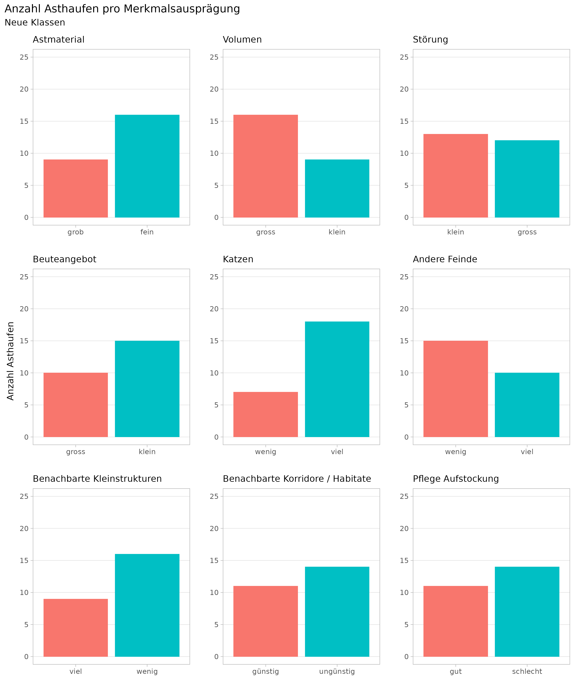

# Anhang

## Anhang A: Nachweiserfolge anderer Studien {#anhang-zusammenstellung}


```{r}


nachweiserfolge_zusammenstellung <- nachweiserfolge_zusammenstellung %>%
  arrange(erfolgskontrolle,Jahr) %>%
  mutate(
    Typ = ifelse(erfolgskontrolle,"Erfolgskontrolle","Sonstige Studie")
  )


nachweiserfolge_zusammenstellung %>%
  select(c(1:4,6)) %>%
  kbl(position = "H",
    col.names = c("Region","Jahr","npos","ntot","Quelle"),
    caption = "Zusammenstellung der Resultate verschiedener Spurentunnel-Untersuchungen. npos entspricht der Anzahl Spurentunnel mit Positivnachweisen, ntot der Anzahl Spurentunnel der entsprechenden Untersuchung."
    ) %>%
  kableExtra::group_rows(index = group_row_indices(nachweiserfolge_zusammenstellung$Typ))

```

## Anhang B: Erhebung 1 (Rohdaten)

<!-- Systematische Wirkungskontrolle -->

```{r}
spurenpapiere_systematisch2 <- spurenpapiere_systematisch %>%
  filter(Detektion) %>%
  select(-c(zielart,Detektion))


if(knitr::is_html_output()){
  
  spurenpapiere_systematisch2 %>%
    select(-c(phase,struktur_id)) %>%
    kbl(
      col.names = c("Woche","Tierart","von","bis"),
      caption = "Tabellarische Darstellung aller Nachweise aus Erhebung 1"
    ) %>%
    kableExtra::group_rows(index = group_row_indices(spurenpapiere_systematisch2$phase, prefix = "Phase: "), bold = TRUE) %>%
    kableExtra::group_rows(index = group_row_indices(spurenpapiere_systematisch2$struktur_id,prefix = "Str"), bold = FALSE,italic = TRUE, hline_after = FALSE)

} 

```

```{r, results = "asis"}
if(!knitr::is_html_output()){
  pander::pandoc.p("Diese Tabelle ist nur in der Online-Version dieses Dokumentes Verfügbar.")
}
```


## Anhang C: Datensatz A (Rohdaten){#anhang-datensatz-a}
```{r}
nachweise_spontan2 <- nachweise_spontan %>%
  select(Jahr,KW,Struktur,Mäuse:Ratte) %>%
  pivot_longer(Mäuse:Ratte) %>%
  filter(!is.na(value)) %>%
  select(-value) %>%
  arrange(Jahr,Struktur,KW)


if(knitr::is_html_output()){
  nachweise_spontan2 %>%
  select(-Jahr,-Struktur) %>%
  kbl(
    col.names = c("KW","Tierart"),
    caption = "Tabellarische Darstellung aller Nachweise aus Datensatz A"
    
  ) %>%
  kableExtra::group_rows(index = group_row_indices(nachweise_spontan2$Jahr,prefix = "Jahr: ")) %>%
  kableExtra::group_rows(index = group_row_indices(nachweise_spontan2$Struktur,prefix = "Struktur: "), bold = FALSE,italic = TRUE, hline_after = FALSE)
}


```


```{r, results = "asis"}
if(!knitr::is_html_output()){
  pander::pandoc.p("Diese Tabelle ist nur in der Online-Version dieses Dokumentes Verfügbar.")
}
```


## Anhang D: Nachweise pro Struktur (Erhebung 1)


```{r}
spurenpapiere_systematisch3 <- spurenpapiere_systematisch %>%
  filter(zielart) %>%
  group_by(struktur_id, tierart) %>%
  summarise(anzahl_nachweise = sum(Detektion))  %>%
  pivot_wider(names_from = tierart, values_from = anzahl_nachweise) %>%
  mutate(total = sum(Hermelin,Iltis,Mauswiesel)) %>%
  arrange(desc(total)) 

caption <- "Anzahl Nachweise der drei Zielarten pro Struktur (Daten aus Erhebung 1)."

if(knitr::is_html_output()){
  library(DT)
  datatable(spurenpapiere_systematisch3,
            caption = caption,
            extensions = 'Buttons', options = list(
              dom = 'Bfrtip',
              buttons = c('csv', 'excel')
            )
  )
} else{
  kable(spurenpapiere_systematisch3,caption = caption)
}
```


## Anhang E: Geodaten für Erhebung 1 & 2


Ein Geopackage mit allen untersuchten Standorten (Erhebung 1 & 2) kann hier heruntergeladen werden: [spurentunnel_fotofallen_standorte.gpkg](https://github.com/wieselundco/erfolgskontrolle/raw/master/images/spurentunnel_fotofallen_standorte.gpkg)

## Anhang F: Asthaufenqualität {#anhang-asthaufen-qualitaet}

```{r}
asthaufen_qualitaet %>%
  kableExtra::kable()%>%
  kableExtra::kable_styling()
```


```{r}

```


## Anhang G: Statistische Modellierung attraktivitätsfördernder Faktoren {#anhang-attraktivitaet-modell}


### Korrelationsmatrix der Faktoren


- *Störung*, *Katzen* und *andere Feinde* sind stark korreliert
- *Volumen*, *Pflege / Aufstockung* sind stark korreliert
- *Astmaterial*, *Volumen* und *Beuteangebot* sind schwach korreliert

```{r}
#correlation plots
cormat <- asthaufen_qualitaet_df %>% 
  select(-total_nach_weise_wk_2019_2020) %>%
  mutate(across(.fns = as.numeric)) %>%  
  cor(method="spearman")

cormat[lower.tri(cormat,diag = FALSE)] <- 9999999
cormat_df <- cormat %>%
  as.data.frame() %>%
  tibble::rownames_to_column("var1") %>%
  pivot_longer(-var1,"var2",values_to = "cor") %>%
  filter(cor <= 1) %>%
  mutate(across(starts_with("var"), ~factor(., levels = rownames(cormat),ordered = TRUE))) %>%
  mutate(across(starts_with("var"), ~fct_relabel(., clean_code)))


cormat_df %>%
  ggplot(aes(var1, var2, size = cor, color = cor)) +
  scale_y_discrete(limits = rev(levels(cormat_df$var1))) +
  scale_x_discrete(limits = rev(levels(cormat_df$var2))) +
  # geom_text(data = ~filter(., var1 == var2),aes(label = var1), color = "black", hjust = 1,nudge_x = -0.5) +
  geom_point() +
  coord_equal() +
  theme_minimal() +
  scale_size_continuous(guide = NULL) +
  scale_color_gradient2("Korrelation",low = "blue",high = "red", mid = "white",limits = c(-1,1)) +
  theme(axis.title = element_blank(), axis.text.x = element_text(angle = 45, hjust = 1), legend.position = "bottom")
```


### Logistischre Regression

#### Poisson

Einfaches Modell, um die Korrelationen zu berücksichtigen


```{r, echo = TRUE}
asthaufen_qualitaet_df3 %>% 
  glm(nachweise_int~
        astmaterial+storung+beute_angebot,data=.,
      family="poisson") %>% summary()

```


Overdispersion (die Varianz sollte ungefähr gleich gross sein wie der Mittelwert)

```{r, echo = TRUE}
asthaufen_qualitaet_df3 %>% 
  select(nachweise_int) %>% 
  summarise(
    sd = sd(nachweise_int),
    var = var(nachweise_int),
    mean = mean(nachweise_int)
    )
```

Der Vergleich zwischen der tatsächlichen und der theoretischen Verteilung zeigt, dass die Daten tendentziell *overdispersed* sind:

```{r, echo = TRUE}
asthaufen_qualitaet_df3 %>%
  group_by(nachweise_int) %>%
  count() %>% 
  ungroup() %>%
  complete(nachweise_int = full_seq(nachweise_int,1), fill = list(n = 0)) %>%
  mutate(poisson = dpois(nachweise_int, lambda = 1.72)) %>%
  pivot_longer(-nachweise_int) %>%
  ggplot(aes(nachweise_int, value, fill = name)) +
  geom_col(position = "dodge") +
  facet_wrap(~name, scales = "free_y")


```

*Goodness of fit test* mit *poisson distribution* zeigt, dass die empirische Verteilung nicht gut zur theoretischen Verteilung passt.


```{r, echo = TRUE}
chisq.test(
  table(factor(asthaufen_qualitaet_df3$nachweise_int,levels=1:7)),
  p=dpois(1:7,1.72),
  rescale.p = TRUE)

```

### Zero-inflation (sihe https://stats.idre.ucla.edu/r/dae/zip/)


```{r, echo = TRUE}
library(pscl)
zeroinfl(nachweise_int~astmaterial+storung+beute_angebot,
                       data=asthaufen_qualitaet_df3,link = "logit") %>%
  summary()
```

### OLS regression

```{r, echo = TRUE}
asthaufen_qualitaet_df3 %>% lm(nachweise_int~
                   astmaterial+volumen+storung+beute_angebot,data=.) %>%
  summary()

asthaufen_qualitaet_df3 %>% lm(sqrt(nachweise_int)~
             astmaterial+volumen+storung+beute_angebot,data=.) %>%
  summary()
asthaufen_qualitaet_df3 %>% lm(nachweise_bool~
             astmaterial+volumen+storung+beute_angebot,data=.) %>%
  summary()
```


### Fishers Exakter Test

```{r, echo = TRUE}
kt = with(asthaufen_qualitaet_df3, table(nachweise_bool, astmaterial ))
kt
fisher.test(kt,alternative = "less")

```

