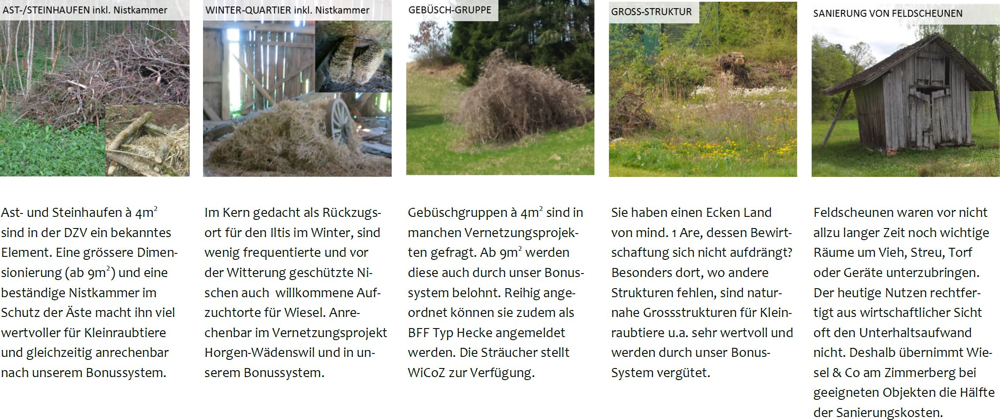

# Anhang


## Anhang A: Förderungsmassnahmen im Projekt {#anhang-massnahmen}


(ref:massnahmen) Eine Zusammenstellung aller Massnahmen, die im Projekt gefördert werden. 

```{r massnahmen, out.width="100%", fig.cap="(ref:massnahmen)"}

```

## Anhang B: Nachweiserfolge anderer Studien {#anhang-zusammenstellung}


```{r}
nachweiserfolge_zusammenstellung <- read_delim("input/nachweiserfolge_zusammenstellung.csv", ";")


nachweiserfolge_zusammenstellung <- nachweiserfolge_zusammenstellung %>%
  arrange(erfolgskontrolle,Jahr) %>%
  mutate(
    Typ = ifelse(erfolgskontrolle,"Erfolgskontrolle","Sonstige Studie")
  )


nachweiserfolge_zusammenstellung %>%
  select(c(1:4,6)) %>%
  kbl(
    col.names = c("Region","Jahr","n$_{+}$","n$_{Σ}$","Quelle"),
    caption = "Zusammenstellung der Resultate verschiedener Spurentunnel-Untersuchungen. n$_{+}$ entspricht der Anzahl Spurentunnel mit Positivnachweisen, n$_{Σ}$ der Anzahl Spurentunnel der entsprechenden Untersuchung."
    ) %>%
  kableExtra::group_rows(index = group_row_indices(nachweiserfolge_zusammenstellung$Typ))

```

## Anhang C: Erhebung 1 (Rohdaten)

<!-- Systematische Wirkungskontrolle -->

```{r}
spurenpapiere_systematisch2 <- spurenpapiere_systematisch %>%
  filter(Detektion) %>%
  select(-c(zielart,Detektion))


if(knitr::is_html_output()){

spurenpapiere_systematisch2 %>%
  select(-c(phase,struktur_id)) %>%
  kbl(
    col.names = c("Woche","Tierart","von","bis"),
    caption = "Tabellarische Darstellung aller Nachweise aus Erhebung 1"
  ) %>%
  kableExtra::group_rows(index = group_row_indices(spurenpapiere_systematisch2$phase, prefix = "Phase: "), bold = TRUE) %>%
  kableExtra::group_rows(index = group_row_indices(spurenpapiere_systematisch2$struktur_id,prefix = "Str"), bold = FALSE,italic = TRUE, hline_after = FALSE)

}

```


## Anhang D: Datensatz A (Rohdaten)
```{r}
nachweise_spontan2 <- nachweise_spontan %>%
  select(Jahr,KW,Struktur,Mäuse:Ratte) %>%
  pivot_longer(Mäuse:Ratte) %>%
  filter(!is.na(value)) %>%
  select(-value) %>%
  arrange(Jahr,Struktur,KW)


if(knitr::is_html_output()){
  nachweise_spontan2 %>%
  select(-Jahr,-Struktur) %>%
  kbl(
    col.names = c("KW","Tierart"),
    caption = "Tabellarische Darstellung aller Nachweise aus Datensatz A"
    
  ) %>%
  kableExtra::group_rows(index = group_row_indices(nachweise_spontan2$Jahr,prefix = "Jahr: ")) %>%
  kableExtra::group_rows(index = group_row_indices(nachweise_spontan2$Struktur,prefix = "Struktur: "), bold = FALSE,italic = TRUE, hline_after = FALSE)
}


```


## Anhang E: Hermelin-Nachweise nach Struktur


(ref:nachweiseprostruktur) Anzahl Hermelinnachweise pro untersuchte Struktur in Erhebung 1.

```{r nachweiseprostruktur, fig.cap="(ref:nachweiseprostruktur)"}
spurenpapiere_systematisch3 <- spurenpapiere_systematisch %>%
  filter(zielart) %>%
  group_by(struktur_id) %>%
  summarise(anzahl_nachweise = sum(Detektion))  %>%
  arrange(desc(anzahl_nachweise)) %>%
  ungroup() %>%
  mutate(
    struktur_id = fct_reorder(as.character(struktur_id),anzahl_nachweise)
  )

ggplot(spurenpapiere_systematisch3, aes(anzahl_nachweise,struktur_id)) +
  geom_col() +
  labs(x = "Anzahl Hermelinnachweise",y = "Struktur ID") +
  theme_light()

```

